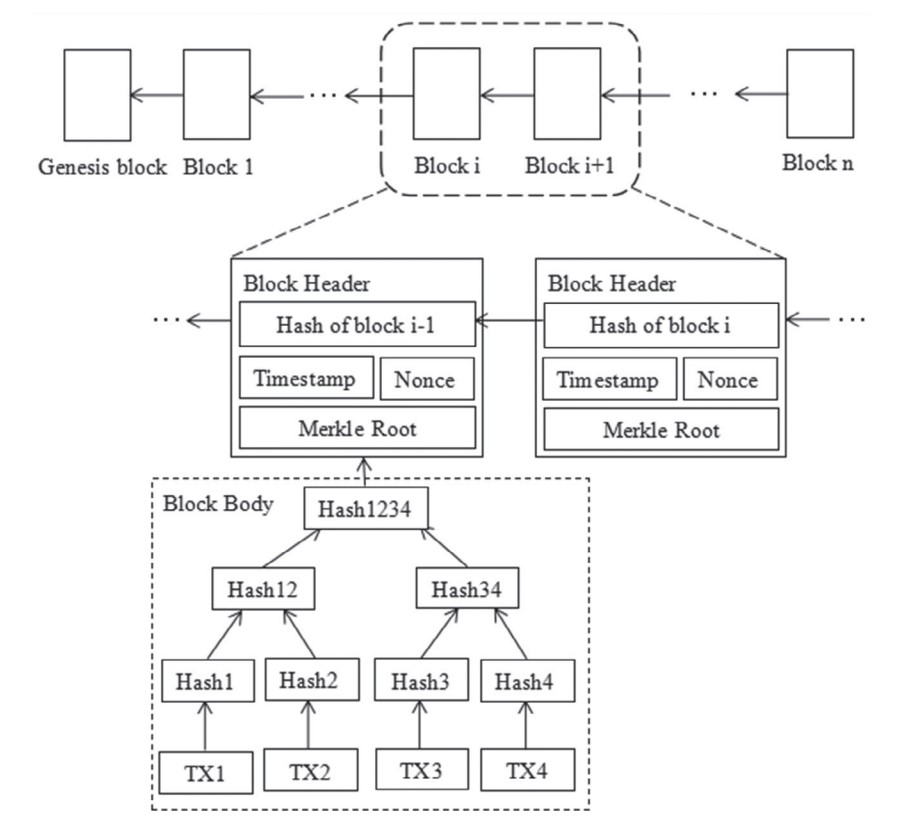

A blockchain block is a fundamental unit of the blockchain structure, serving as an immutable record within the distributed ledger. It acts like a container for transaction data on a blockchain network. Each block in a blockchain is a secured, verifiable data structure linked to its predecessor, forming a chain that is resistant to modification and provides a transparent and distributed record-keeping system.

**Block Structure**

A block is a data structure that stores a set of transactions and other metadata. Each block contains:

1. **Header**:
   - **Block Version**: Indicates which set of block validation rules to follow.
   - **Previous Block Hash**: A reference to the hash of the previous block, ensuring the integrity and continuity of the blockchain.
   - **Merkle Root**: A hash representing the root of a Merkle tree constructed from the transactions in the block, enabling efficient and secure verification of transaction integrity.
   - **Timestamp**: The time at which the block was created, recorded in Unix epoch format.
   - **Nonce**: A variable used in the proof-of-work (PoW) algorithm to vary the hash output. It is incremented during the mining process until the block hash meets the network’s difficulty target.
   - **Difficulty Target**: Defines the complexity of the PoW challenge, dynamically adjusted to maintain a consistent block creation time across the network.

2. **Body**:
   - **Transaction Counter**: The number of transactions in the block.
   - **Transactions**: A list of transactions included in the block. Each transaction contains:
     - **Inputs**: References to previous transactions' outputs, serving as the source of funds or data.
     - **Outputs**: New addresses and the amounts being transferred or stored.
     - **Signatures**: Cryptographic proofs that the transaction sender owns the private keys corresponding to the input addresses.


**Visualization**

```plaintext
Block
+-----------------------------------------------------+
| Header                                              |
| +-------------------------------------------------+ |
| | Previous Block Hash                             | |
| +-------------------------------------------------+ |
| | Merkle Root                                     | |
| +-------------------------------------------------+ |
| | Timestamp                                       | |
| +-------------------------------------------------+ |
| | Nonce                                           | |
| +-------------------------------------------------+ |
| | Difficulty Target                               | |
| +-------------------------------------------------+ |
+-----------------------------------------------------+
| Body                                                |
| +-------------------------------------------------+ |
| | Transaction 1                                   | |
| | - Inputs                                        | |
| | - Outputs                                       | |
| | - Signatures                                    | |
| +-------------------------------------------------+ |
| | Transaction 2                                   | |
| | - Inputs                                        | |
| | - Outputs                                       | |
| | - Signatures                                    | |
| +-------------------------------------------------+ |
| | ...                                             | |
+-----------------------------------------------------+
```


**Hashing and Security**

Each block’s header is hashed using a cryptographic hash function (e.g., SHA-256 in Bitcoin). This hash is used as the block's unique identifier. Changing any part of a block (transactions, timestamp, etc.) would alter its hash, breaking the link to subsequent blocks and making tampering evident and rejected by the network. Various consensus mechanisms, such as PoW, Proof-of-Stake (PoS), or Practical Byzantine Fault Tolerance (PBFT), are used to validate new blocks and add them to the blockchain.

**Merkle Trees**

Transactions are hashed and paired recursively to form a binary tree. The root of this tree (the Merkle root) is included in the block header. To verify the inclusion of a transaction, only a small subset of hashes (Merkle path) is needed, making it computationally efficient.

**Block Creation and Mining**

New transactions are broadcast to the network and collected into a candidate block by miners. Miners then compete to solve a computationally intensive proof-of-work problem that requires finding a nonce value that results in the block's hash meeting a predetermined difficulty target. The first miner to solve this is allowed to add the new block to the chain. Successful miners receive a reward, often in the form of cryptocurrency, along with transaction fees included in the block.





The integrity of the blockchain is maintained through cryptographic techniques and consensus protocols, ensuring trust in a decentralized environment. Understanding block structure and the process of adding them is essential to grasp how blockchains function.

Citations:
- https://www.theblock.co/learn/245697/what-are-blocks-in-a-blockchain
- https://www.simplilearn.com/tutorials/blockchain-tutorial/blockchain-technology
- https://www.coindesk.com/learn/how-blocks-are-added-to-a-blockchain-explained-simply/
- https://www.investopedia.com/terms/b/blockchain.asp
- https://www.investopedia.com/terms/b/block-bitcoin-block.asp