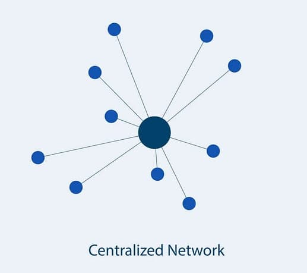
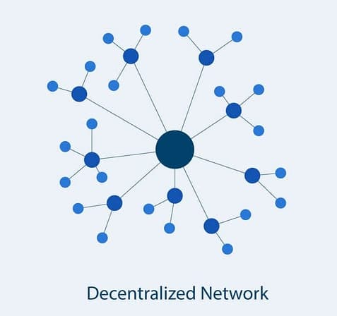

In our previous post, [we introduced the evolution of web from web1 to web3](/blog/blockchain-and-ethereum-fundamentals/01-the-evolution-of-the-web-web1-web2-web3). Today, let’s dig into one of the most important concepts that makes blockchain unique — **decentralization**. To understand why decentralization matters, we first need to look at what centralized systems are and how they differ from decentralized ones.

---

## What is a Centralized System?

A **centralized system** is one where a single authority controls the entire network or service. Most of the platforms and services we use every day fall under this category:

* Google (search engine, Gmail, etc.)
* WhatsApp (owned by Meta)
* Amazon (e-commerce giant)
* Banks and central banks
* Governments
* Coinbase (yes, even though it deals with cryptocurrency, it’s still centralized!)

In such systems:

* One entity has **complete control**.
* Users must place **trust** in that authority.
* Access, privileges, or data can be **restricted, censored, or revoked**.

👉 Example: When you deposit money in a bank, you’re trusting that the bank will keep it safe and let you withdraw when needed. Similarly, when you shop on Amazon, you trust they will deliver your product or refund you if something goes wrong.

Photo by [medium.com](https://medium.com/crypto-wisdom/dex-decentralized-exchange-simplified-61ff0fc640dd)

---

## What is a Decentralized System?

A **decentralized system** distributes control across many nodes instead of one central authority. Here, no single entity owns or governs the network.

Key properties:

* **No single point of failure** — if one node goes down, others keep the system running.
* **No gatekeepers** — theoretically, anyone can participate.
* **Censorship resistance** — data cannot easily be deleted or manipulated.
* **Trustless interactions** — instead of trusting one organization, you rely on the network’s consensus and cryptographic rules.

👉 Example: In blockchain networks like Bitcoin or Ethereum, thousands of nodes maintain the system. Even if a portion of nodes fails or acts maliciously, the network as a whole continues to function.

Photo by [medium.com](https://medium.com/crypto-wisdom/dex-decentralized-exchange-simplified-61ff0fc640dd)

---

## Coinbase Example: Centralized Exchange in a Decentralized World

It’s easy to assume that just because something involves cryptocurrency, it’s decentralized. That’s not always true.

* **Coinbase** is a centralized cryptocurrency exchange.
* The company can **freeze your funds, ban your account, or impose country-based restrictions**.
* You’re essentially trusting Coinbase in the same way you trust a bank.

Lesson: *Not everything related to crypto is automatically decentralized.*

---

## Centralized vs Decentralized: Key Differences

Here’s a quick comparison of the two:

| Feature            | Centralized                    | Decentralized                                       |
| ------------------ | ------------------------------ | --------------------------------------------------- |
| **Control**        | Single authority               | Distributed across many nodes                       |
| **Trust**          | Users must trust the authority | Trust placed in cryptography + consensus            |
| **Speed**          | High performance, low latency  | Slower due to network-wide validation               |
| **Data Conflicts** | Easy to resolve centrally      | Requires complex protocols                          |
| **Failure**        | Single point of failure        | Network continues even if nodes fail                |
| **Censorship**     | Data can be changed or deleted | Nearly impossible to alter existing data            |
| **Participation**  | Permissioned (gatekeepers)     | Open to anyone (sometimes financial barriers apply) |

---

## When to Use Decentralization?

Decentralization isn’t always the best choice. If you’re building a simple app or website where **speed and efficiency** matter more than trust, a centralized setup is usually better.

But in cases where:

* **Trust cannot be guaranteed**
* **Censorship must be avoided**
* **Security and fairness are critical**

…decentralization becomes a game-changer.

This is why blockchain is so powerful — it allows **trustless interactions** without relying on a central authority.

---

## Key Takeaway

* **Centralized systems** are fast, simple, but require trust in one authority.
* **Decentralized systems** are slower, complex, but allow fairness, censorship-resistance, and trustless interactions.

And this is exactly why blockchain networks are designed to be decentralized — so you don’t need to trust a single company, government, or server. Instead, you trust the **mathematics, cryptography, and protocols** that power the blockchain.

---

👉 In the next post, we’ll dive into **Ledgers**, the foundation of how blockchains record and maintain data securely.
