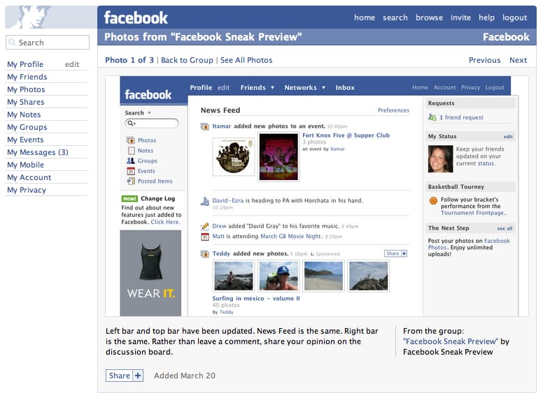
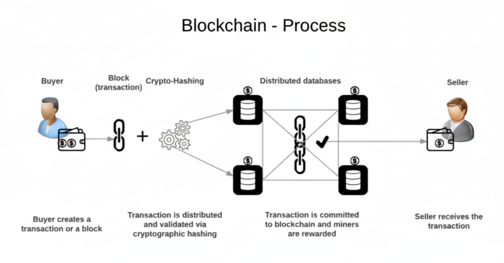

Welcome to the very first post of the **Blockchain Fundamentals** series! To understand why blockchain matters, we first need to look at how the web itself has evolved.

## 🌐 Web 1.0 – The “Read-Only” Web (1991–2004)

* **Static pages** with very little interactivity.
* Mostly used for browsing and searching information.
* Looked like digital books or research papers.
* Advertisements were actually banned in the early web days.

👉 *In short: Web1 was all about **consuming information**, not creating it.*

Photo courtesy of [Chris Messina](https://www.flickr.com/photos/factoryjoe/430909335)

---

## 🌍 Web 2.0 – The “Read & Write” Web (2004–Present)

* Social media platforms like Facebook, Twitter, and YouTube rise.
* User-generated content and communities thrive.
* Dynamic websites powered by JavaScript and AJAX.
* Focus on **UI/UX** – smooth interfaces, animations, interactions.
* **Data controlled by intermediaries** (Google, Twitter, Facebook, etc.).

👉 *Web2 unlocked massive interactivity but centralized power. Your data belongs to companies, not you.*

.jpg)
Photo by [pickpik.com](https://www.pickpik.com/facebook-twitter-instagram-apps-icons-technology-77348)

---

## 🌐 Web 3.0 – The “Read, Write & Own” Web (Future & Emerging)

* Powered by **blockchain, cryptocurrencies, and decentralization.**
* Focus shifts to **back-end systems, data storage, and ledgers** rather than just shiny UIs.
* **No central authority owns your data** – ownership is distributed across the network.
* Immersion > interaction (think **metaverse** instead of just browsing a site).
* Incorporates AI, blockchain, and decentralized finance (DeFi).

👉 *Web3 is about **ownership and control**, not just access. You own your content, your identity, and your digital assets.*

Photo by [easy-peasy.ai](https://easy-peasy.ai/ai-image-generator/images/explore-power-web3-domains-blockchain-artistry)

---

## Web2 vs Web3 in Action

Let’s make this practical with a few examples:

1. **Tweets (Content Ownership)**

   * *Web2:* Twitter owns your tweets. They can censor or delete them.
   * *Web3:* Your post lives on a decentralized platform. Once published, it cannot be altered or deleted.

2. **Payments (Financial Control)**

   * *Web2:* Platforms like PayPal require personal details and can freeze your account anytime.
   * *Web3:* Crypto wallets allow you to send and receive money freely, with no need for permission or personal data.

3. **Internet Providers (Single Point of Failure)**

   * *Web2:* A single telecom outage can knock a country offline.
   * *Web3:* Networks are distributed globally across thousands of nodes, making it nearly impossible to shut down.

---

## Quick Introduction to Blockchain

Now that you see why Web3 matters, let’s touch on the core technology behind it: **blockchain.**

At its core, a **blockchain is a digital ledger of transactions** that is:

* **Immutable** – nearly impossible to change, hack, or cheat.
* **Distributed** – duplicated across thousands of machines.
* **Decentralized** – no single entity owns it; the entire network maintains it.

Think of blockchain like a **public logbook** where everyone keeps a copy. If one copy is lost or tampered with, the network’s majority still preserves the truth.

Photo by [wikimedia.org](https://commons.wikimedia.org/wiki/File:Blockchain-Process.png)

---

## Key Takeaways

* **Web1 = Read-only** (consume information).
* **Web2 = Read & write** (interact, but centralized).
* **Web3 = Read, write & own** (decentralized and user-controlled).
* Blockchain is the backbone of Web3, ensuring **security, transparency, and decentralization.**

---

👉 Read next: [Centralized vs Decentralized: Understanding the Core Difference](/blog/blockchain-and-ethereum-fundamentals/02-centralized-vs-decentralized-understanding-the-core-difference)
